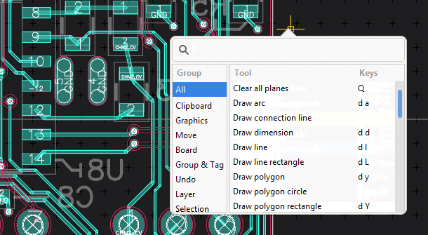
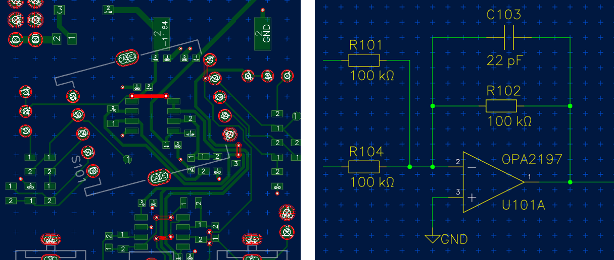
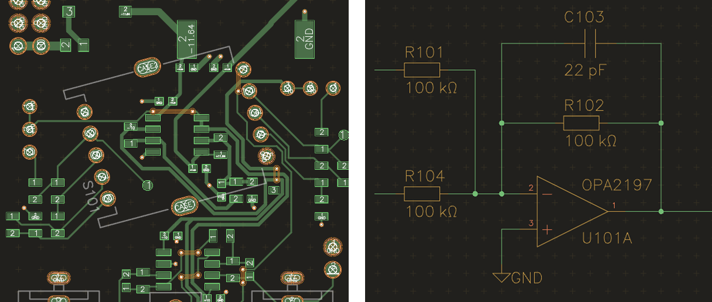
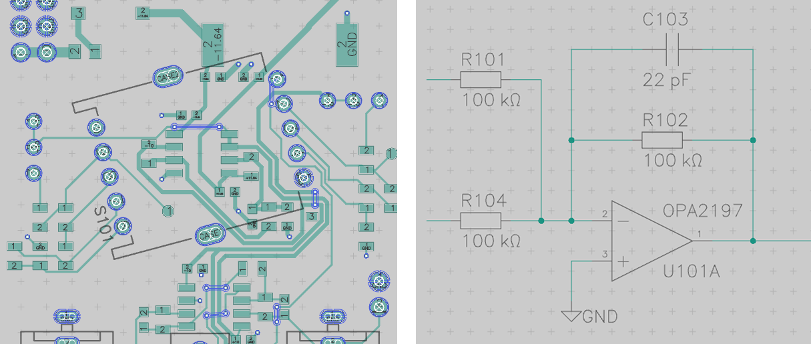
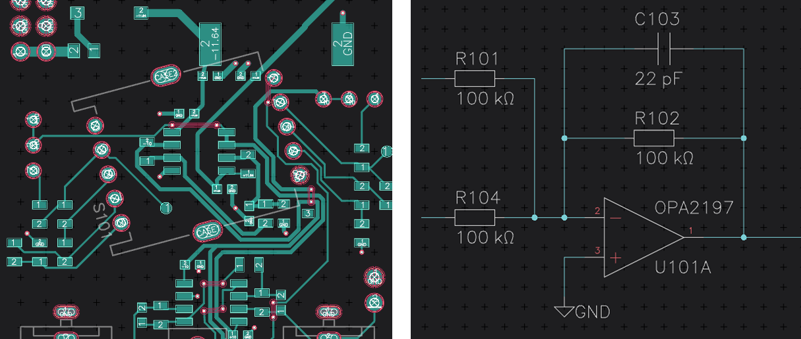
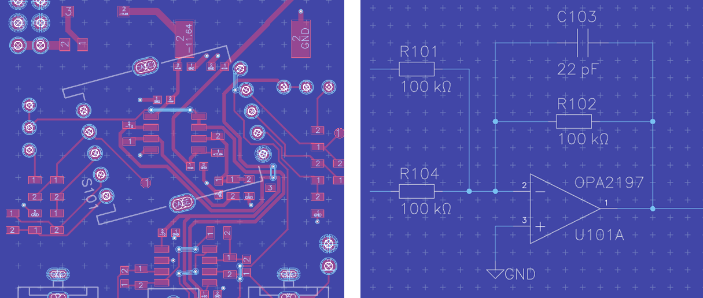

Přehled funkcí
==============
.. feature-overview.rst

Interaktivní a jednoduchý management součástí
---------------------------------------------

Snadná správa součástí, pouzder součástek a symbolů schemat pomocí správce fondu knihovny součástí (Pool manager):

.. image :: images / pool-mgr.png

Přiřazení vývodů k pájecím ploškám v editoru součástí (Part editor):

.. image :: images / part-editor.png

Snadné vytváření součástí
-------------------------

Jednoduše přidejte vývody tak, jak jsou uvedeny v katalogovém listu součástky:

.. image :: images / part-wiz-pads.png

Horizon-EDA se dodává také se šablonami skriptů pro import průmyslového standardu
ve formátech jako je IBIS, který vám ušetří zdlouhavou práci při opisování toho, co je v katalogovém listu.

Loves beginners and power users alike
-------------------------------------

Just press the spacebar and get a list of all the actions you can perform. These actions can be bound to customizible single key shortcuts or to vim-like multi key sequences.

Schematický editor, který ví co děláte
--------------------------------------

Kreslení schemat není jen o linkách a štítcích. Schéma v editoru Horizon EDA
ví o jednotlivých spojích a zeptá se vás na jejich sloučení:

.. image :: images / net_merge.png

Umístí uzly tam, kde by měly být:

.. image :: images / net.png

Také automaticky přeorientuje texty, takže se tím vyhnete
těžko čitelnému referenčnímu označení:

.. image :: images / text-align.png

Ani sběrnice nejsou Horizonu cizí:

.. image :: images / buses.png

Interaktivní trasér spojů s přímou kontrolou pravidel (DRC)
-----------------------------------------------------------

Pomocí interaktivního traséru (routeru) původně vyvinutého pro KiCad, se vytváření spojů
 stane hračkou. Samozřejmě respektuje vaše pravidla návrhu.

.. image :: images / routing.png

Silná pravidla
--------------

S výkonnými a flexibilními pravidly může horizont kontrolovat a upravovat váš
návrh splňující nastavená kriteria:

.. image :: images / rules.png

Pokud něco nesplňuje vaše požadavky, horizont přesně řekne, co to je a
na kterém místě:

.. image :: images / drc.png

Průmyslové standardy výroby
---------------------------

Až bude váš návrh připraven k výrobě, jednoduše exportujte ve formátu
průmyslového standartu Gerber a NC-vrtání ve formátu RS-274X:

.. image :: images / fab-out.png

3D pohled
---------

Podívejte se na svou desku, jako byste ji drželi ve svých rukou. Za použití funkce rozpadu (Explode), můžete vrstvy zobrazit oddělené.

.. image :: images / 3d.png

Customizable color schemes for both schematic and board editors
---------------------------------------------------------------

Decoration affects people, and people are different – do your own thing or select from the existing color schemes.

Je toho mnohem víc
------------------

- Akcelerované zobrazování (OpenGL)
- Neomezená možnost příkazů zpět / opakování
- Kopírování / vkládání, a to i mezi instancemi
- Vyplněné plochy spojů
- Spoje diferenciálního páru
- Libovolné tvary pájecích míst

