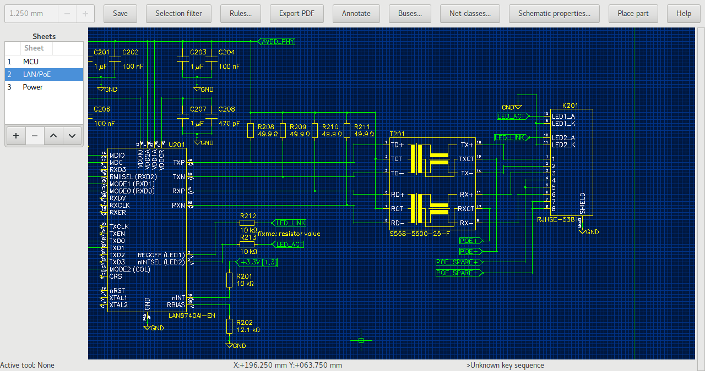

Editor schémat
==============
.. imp-sch.rst

Chcete-li spustit editor schémat, klikněte v manažeru projektu na „Top Schematic“. Podobně jako jiné grafické editory, schematický editor v Horizon-EDA je založen na :doc:`Interaktivním manipulátoru <imp_cz>`. Chcete-li umístit součástky, použijte příkaz „Place part“ nebo prohlížeč součástí v hlavním projektu. Ten je mnohem pohodlnější, protože může být trvale otevřený. Začněte kreslit propojení (vodiče) schematu stisknutím Klávesy „n“.

Spoje a segmenty spojů (Nets)
-----------------------------

Na rozdíl od některých jiných schématických editorů Horizon-EDA si eviduje jednotlivá propojení a nejde jen o nakreslenou čáru (vodič), která se nakonec při generování seznamu spojů (netlistu) transformuje na vodič (spoj). Propojení může být reprezentováno jedním nebo více segmenty vodičů. Segment spoje je sada propojení vodičů, uzlů, vývodů atd. všechny propojené vodiči (čárami spoje). Editor sleduje, které vodiče patří do kterého segmentu a oznamuje, když se operace chystá sloučit dva segmenty.

Když se podíváte na spoj v editoru vlastností po výběru spoje, spoj v editoru vlastností je „celý“ spoj, nejen segment spoje. Proto přejmenování spoje nemění propojení. Pro připojení vývodu na segment jiného spoje, použijte nástroj pro přesunutí segmentu do jiného nebo nový spoj “Move net segment to other/new net”.

Štítek spoje (Net label) pouze zobrazuje název spoje, ke kterému je připojen, ale nemění ho. Upozorňuje vás na nekonzistenci v systému schématu, které by mohlo mít za následek nežádoucí propojení, editor schématu umístí varování na porušené položky.

Symboly napájení (Power Nets)
-----------------------------

Nejjednodušší způsob vytvoření symbolu napájení ve schematu je použít příkaz pro správu napájení „Manage Power Nets“. Příkaz je k dispozici v menu hamburger |hamburger|. Poté použijte příkaz „place power symbol“, pro umístění symbolu napájení pro tento spoj. Symboly napájení "napájí" jejich vodiče a připojené segmenty. Můžete si vybrat ze tří stylů napájecích symbolů ve výše uvedeném příkazu. Symboly antény a tečky
lze umístit buď nahoru nebo dolů. Symbol GND může směřovat pouze dolů.

Sběrnice (Buses)
----------------

Pro seskupení souvisejících vodičů použijte sběrnice (Buses). Po vytvoření sběrnice přidejte vodiče. Můžete buď přiřadit existující vodiče nebo nově pojmenovat automaticky vytvořený vodič kliknutím na tlačítko se šipkou vedle ní.

.. _Diferenciální páry:

Diferenciální páry (Diff. pairs)
--------------------------------

Chcete-li vytvořit diferenciální pár, vyberte dva vodiče, které chcete spárovat a spusťte příkaz „Set diff. pair". Můžete také vybrat jeden vodič a budete požádáni o druhý. Chcete-li oddělit vodiče, použijte příkaz „Clear diff. pair". Doporučuje se přiřadit oběma vodičům stejnou hladinu (Netclass) např. „100diff“, abyste jim mohli snadno nastavit stejná pravidla.

Přímo na desku (To board)
----------------------------

Chcete-li usnadnit umísťování pouzder součástek na desku plošných spojů DPS (PCB), jednoduše vyberte
požadované symboly a stiskněte „To board“. Tím se přepnete na editor desky dále spusťte nástroj „place package“ s pouzdry pro vybrané symboly. Možná bude nutné nejdříve znovu načíst seznam spojů (netlist) v Editoru desky, aby editor desky načetl nové komponenty.

Snímek obrazovky
----------------

