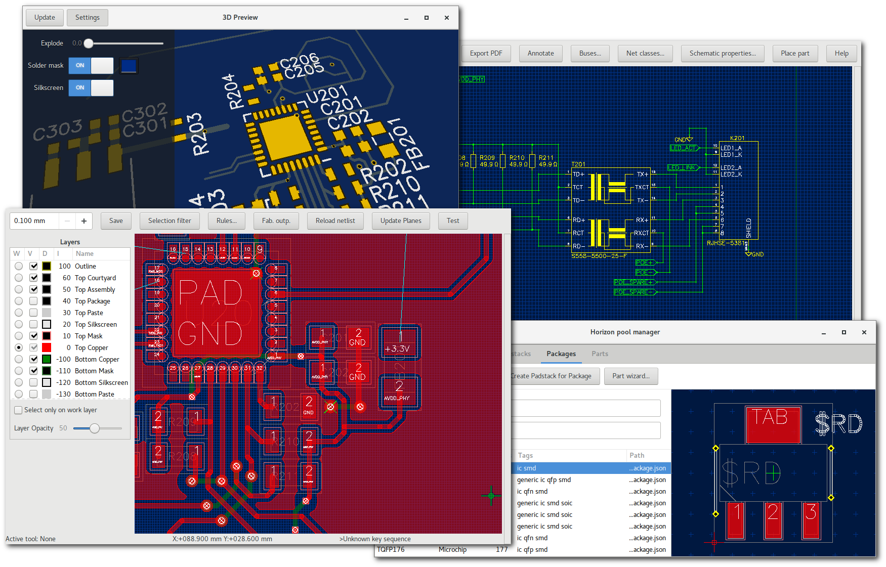

Dokumentace Horizontu EDA
=========================

Podívejte se na dokumentaci programu Horizon EDA :doc:`Hlavní výhody <feature-overview>` nebo přímo :doc:`Začínáme <getting-started>`.

.. toctree::
   :maxdepth: 1
   :caption: Obsah:

   feature-overview
   imp
   imp-board
   imp-sch
   build-win32
   build-linux
   rules
   create-package
   copy-layout-placement
   parameter-programs
   cli-usage
   getting-started
   padstacks
   theory-of-operation
   pool
   pool-mgr
   backannotation
