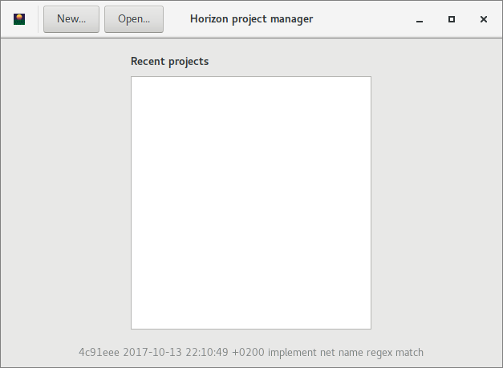
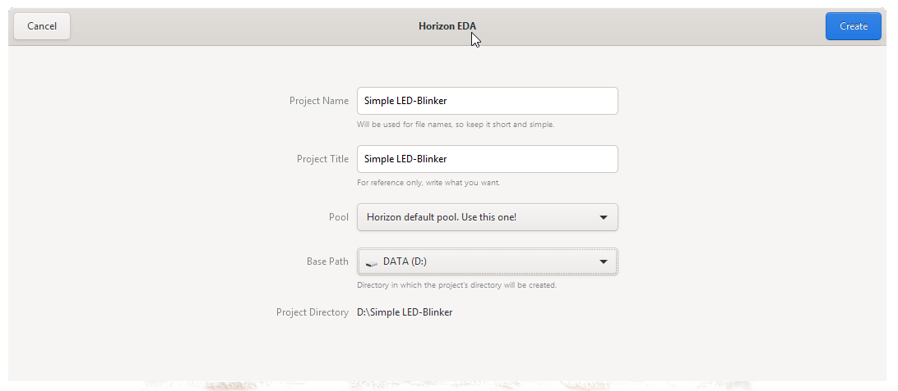
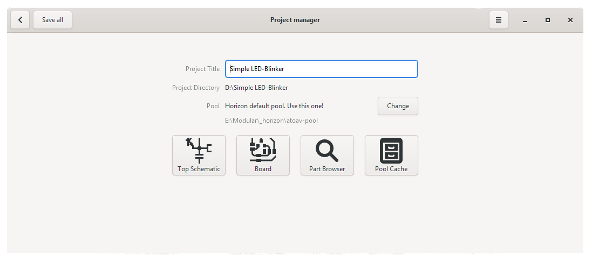

Vytvořte nový projekt
=====================

Když spustíte program Horizon-EDA mělo by se zobrazit okno podobné tomuto

Ujistěte se že máte nastavený a přidaný fond knihoven součástek

Klikněte na ikonu aplikace v levém horním rohu a otevřete
dialog nastavení. Přidejte fond, který jste právě stáhli, tím, že vyberete složku obsahující soubor
``pool.json``. Když to dokončíte dialogové okno předvoleb by mělo vypadat takto:

.. image :: images / pool-prefs.png

Nyní vytvořte nový projekt klepnutím na "New...".

In the Project Dialogue Window you can select a project name and a location where you want to store the project folder. Additionally you can change the active pool: 

In the Project manager window that opens now, you can create a Schematic, a Board, Browse for Parts or Manage the Pool Cache. 

The Pool Cache stores a copy of all parts that you used in you project and helps you to protect your projects from outside changes (e.g. by updates in the Pool). When you *want* to update the parts, or remove unused parts you can do so in the Pool Cache Window.

Next: :doc:`Draw a Schematic <draw-schematic>`

